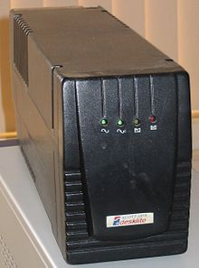

# Introduction
- You will learn to measure some basic electrical parameters.
- You will know the very basic concepts of electricity that will allow you to:
    - choose a suitable power supply for the computer
    - choose a suitable UPS for the computer system

  
## Vocabulary

- **230 V** : is the official voltage value of Spain. [To see in other countries click here](https://es.wikipedia.org/wiki/Anexo:Enchufes,_voltajes_y_frecuencias_por_pa%C3%ADs) .
- **50 Hz** : it is the value of the official frequency of Spain
- **CA** : alternating current (abbreviated CA in Spanish and AC in English, from alternating current) electrical.
- **CC** : direct current or direct current (CC in Spanish, in English DC, from Direct Current) refers to the continuous flow
- **GND** : ("ground" = Earth in English), applies to the largest metallic mass of electronic equipment, which includes the chassis and the cabinet where it is installed. Wires connected to GND are usually colored black, sometimes white.
- **Connection** : derivation from the supply company's distribution network to the building or property where the electrical energy will be used. The connections end at the so-called electric meter, where the user's installation begins.
- **Load** of a source: percentage (%) supplied of its nominal output. It is a division between the maximum power that a source can supply and the current consumed by the devices connected to it. For example: if a power supply can supply 400W and currently supplies 100W, its load will be 25%. Load (%)= (power consumed / maximum power) \* 100.

# Electrical disturbances

The low-voltage electrical distribution network presents a quality voltage wave that could be disturbed, very occasionally, by faults in the lines and transformation centers, maneuvers, as well as mainly by atmospheric electrical discharges. 

Users subject the network to the influence of a multitude of loads that, even if they function correctly, can alter the voltage wave with excessive permanent or transient drops, among other disturbances. 

In addition, the loads can break down and produce abnormal consumption and short circuits that must be isolated by the protection systems. 

As long as the faulty load is not isolated, it can cause important disturbances in the nearby points of the network.

- **Computer power systems**
    - Introduction. Maintenance and Assembly of Computer
    - Vocabulary. Maintenance and Assembly of Computer Equipment
    - Measurement of electrical parameters. Maintenance and Assembly of IT Equipment.
    - Power supply.  Maintenance and Assembly of IT Equipment/Item 5/The power supply Maintenance and Assembly of IT Equipment".
    - [S.A.I.](unit1/ups.md)
    - [Activities](unit1/activities.md)