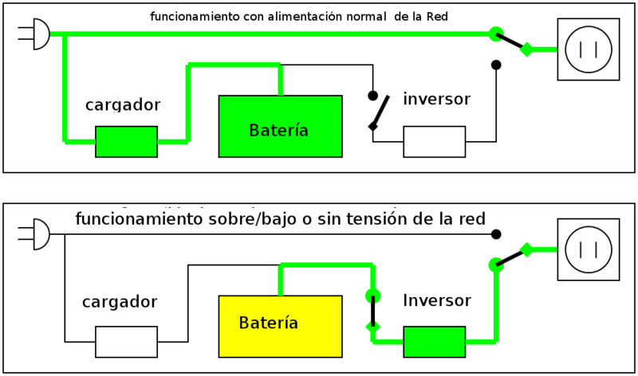
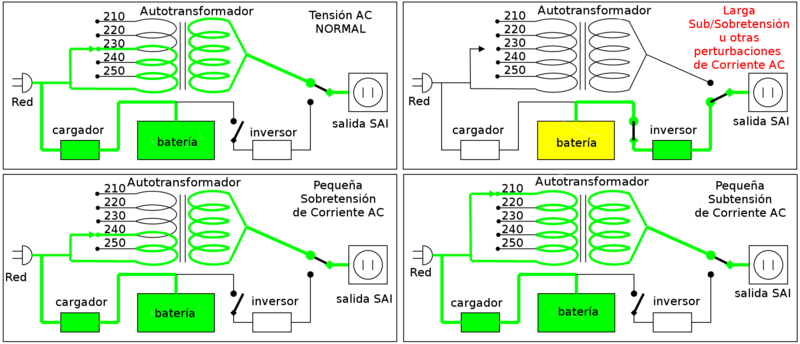
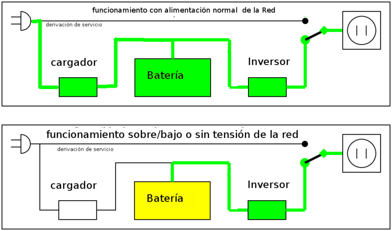

# UPS Types

## Standby or Offline UPS

The Offline UPS (according to the IEC 62040-3 VFD classification standard) has two main circuits: the line power supply, to which only a stabilizer and additional filtering is added to the normal one for each equipment to be powered, and the UPS circuit itself. , whose core is the circuit called "inverter".

It is called a "stand-by" system, or waiting, because the alternative power supply circuit, the inverter, is "off-line" or inactive , waiting to start operating when a power failure occurs network. It has a switching element that alternately connects and disconnects one or the other circuit. For domestic use when there are not many disturbances. 

## Line Interactive UPS

The Line-interactive UPS (according to the IEC 62040-3 classification VI standard), in addition to what it does to the Standby UPS, can correct small voltage and/or frequency displacements, regenerating wave the alternating permanently without using the battery. 

For domestic use when there are many disturbances. For professional use, it is the basic option. 

## UPS On-line or Double Conversion

The Double Conversion UPS (according to IEC 62040-3 VFI classification) is ideal for environments where it is necessary or for equipment that is very sensitive to power fluctuations and needs to have strong electrical insulation. The initial cost of the double conversion UPS may be higher, but its total cost is generally lower due to longer battery life. This type of UPS may be necessary when there are many and frequent electrical disturbances in the environment and protection of sensitive loads is required.

The basic technology of the Double Conversion UPS is the same as in standby mode. However, it typically costs much more money , because it has a higher performance charger, rectifier, and inverter designed to run continuously with improved refrigeration systems.

In a Double Conversion UPS, the batteries are always connected to the inverter . When power loss occurs, the rectifier simply falls out of circuit and the batteries maintain constant, unchanged power. When power is restored, the rectifier resumes carrying the bulk of the load and begins charging the batteries.

The main advantage of Double Conversion UPSs is their ability to provide total isolation of the load from the mains. It is the most used for cargo protection.

For professional use, it is used in computers with tasks in which people's lives may be in danger. 