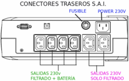

# Uninterruptible Power Supply

An **uninterruptible power supply** , UPS, also known as UPS (uninterruptible power supply), is a device that will supply electricity (depending on the rear connector used) to a computer when there is a disturbance or failure in the power supply, allowing the user(s) to continue working for several minutes (those allowed by the UPS battery reserve), giving them time to close their files and turn off the network in an orderly manner until the power supply is restored.

The basic operation of this equipment, in the event of a power failure, uses the electrical energy stored in the batteries.

## Basic components of the UPS

- **Charger** , it is made up of:
    - **Rectifier** : converts alternating voltage (AC) into direct voltage (DC).
    - **Regulator** : regulates the charging voltage of the batteries, preventing them from being charged at voltages higher than those allowed.
- **Battery** – Stores direct current (DC) and has a certain charge capacity measured in Ampere-Hours (Ah) .
- **Inverter** : converts direct current (DC) coming from the battery into alternating voltage (AC). This alternating voltage will be the one supplied to the load.
- **Bypass or selector** : allows the load to be supplied with voltage by the inverter or, alternatively, directly from the electrical network. The bypass is usually used to carry out maintenance tasks on the UPS and prevents the load from running out of supply voltage or when any type of problem occurs in the UPS (failures in the rectifier, inverter, etc.